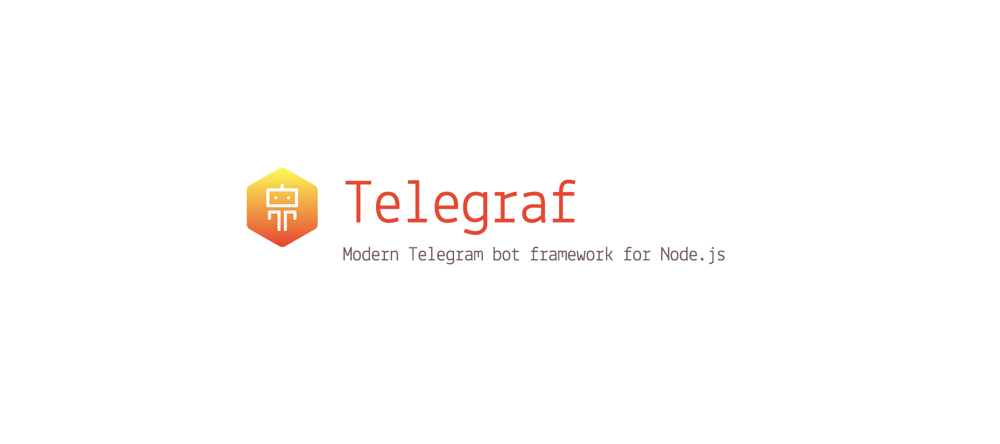

Bots are special [Telegram](https://telegram.org) accounts designed to handle messages automatically. 
Users can interact with bots by sending them command messages in private or group chats. 
These accounts serve as an interface for code running somewhere on your server.

## Features

- Full [Telegram Bot API](https://core.telegram.org/bots/api) support
- [Inline mode](https://core.telegram.org/bots/api#inline-mode)
- [Games](https://core.telegram.org/bots/api#games)
- AWS **λ**/now/dokku/Heroku ready
- http/https/Connect/express.js webhooks
- Incredibly fast
- Easy to extend

## Installation

```js
$ npm install telegraf --save
```

## Telegram token

To use the [Telegram Bot API](https://core.telegram.org/bots/api), 
you first have to [get a bot account](https://core.telegram.org/bots) 
by [chatting with BotFather](https://core.telegram.org/bots#6-botfather).

BotFather will give you a **token**, something like `123456789:AbCdfGhIJKlmNoQQRsTUVwxyZ`.
With the token in hand, you can start developing your bot.

## Example
  
```js
const Telegraf = require('telegraf')

const app = new Telegraf(process.env.BOT_TOKEN)
app.command('start', (ctx) => ctx.reply('Hey'))
app.on('sticker', (ctx) => ctx.reply('👍'))
app.startPolling()
```

There's some cool [examples](https://github.com/telegraf/telegraf/tree/master/examples)
